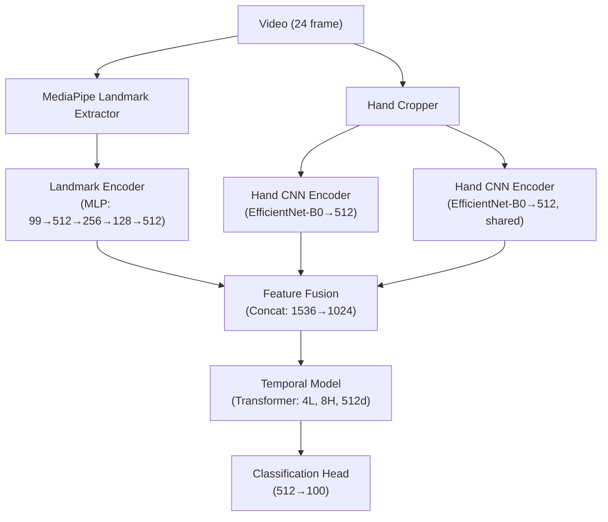

# 🧠 ASL Modeli Mimari İyileştirme Planı

## Mevcut Mimari Analizi

Mevcut hibrit model 5 bileşenden oluşuyor:



### Mevcut Zayıf Noktalar

| Bileşen | Mevcut | Problem |
|:---|:---|:---|
| **Landmark Encoder** | Basit MLP (flatten → FC) | Eklemler arası uzamsal ilişkiyi görmezden gelir. Omuz-dirsek-bilek hiyerarşisi, parmak bağlantıları tamamen kaybedilir |
| **Fusion** | Concat + Linear | Modaliteler arası etkileşimi modelleyemez. El görüntüsüyle iskelet bilgisi arasındaki korelasyonu yakalayamaz |
| **Açıklanabilirlik** | Yok | Model hangi eklemlere / frameler'e odaklandığı bilinmiyor. Bitirme tezi sunumunda zayıf kalır |

---

## 📚 Literatür Araştırması Özeti

### ASL Citizen Dataset Benchmark Sonuçları
- **Baseline (I3D):** ~63% Recall@1
- **Baseline (ST-GCN):** Pose-based modellerde güçlü performans
- **Recall@10:** ~91%
- Bizim 100 sınıf alt kümemizde (top-100 gloss) çok daha yüksek doğruluk beklenir (daha az sınıf = daha kolay problem)

### SOTA Yaklaşımlar (2024-2025)

| Model/Yaklaşım | Kullanım | Performans Etkisi |
|:---|:---|:---|
| **ST-GCN + Transformer** (SignFormer-GCN, 2025) | Skeleton stream | Vanilla MLP'ye göre **+8-15%** accuracy |
| **Cross-Attention Fusion** (Dual-Branch) | Multimodal fusion | Concat'a göre **+3-7%** accuracy |
| **Gated Fusion** (Adaptive weighting) | Missing modality handling | Concat'a göre **+2-5%** accuracy |
| **Grad-CAM + Joint Attention** | Açıklanabilirlik | Doğrudan accuracy etkisi yok, ama hata analizi ve güven artışı |

---

## 🔧 Önerilen Değişiklikler (3 Modül)

### İyileştirme 1: ST-GCN Landmark Encoder 🦴

**Neden?** Mevcut MLP, 33 pose landmark'ı düz bir vektör olarak alıyor (99 boyut). Bu, eklemler arası **topolojik ilişkiyi tamamen kaybeder**. Omuz → Dirsek → Bilek zinciri, parmak bağlantıları, simetri bilgisi — bunların hiçbiri öğrenilemiyor.

**Ne yapacağız?** Pose landmark'ları bir **graf** olarak modelleyip, GCN katmanları ile uzamsal ilişkileri çıkaracağız.

```text
Mevcut:                          Yeni:
Landmarks (33,3)                 Landmarks (33,3)
      │                                │
    Flatten                      Graph (33 node, ~40 edge)
      │                                │
  MLP(99→512)                    GCN Layer 1 (3→64)
      │                                │
  MLP(512→256)                   GCN Layer 2 (64→128)
      │                                │
  MLP(256→128)                   GCN Layer 3 (128→256)
      │                                │
  MLP(128→512)                   Global Pool → FC(256→512)
```

#### [NEW] [stgcn_encoder.py](file:///c:/Projelerim/BitirmeProjesiBirlesim/BitirmeProjesi/src/models/encoders/stgcn_encoder.py)

Yeni dosya: `src/models/encoders/stgcn_encoder.py`

- MediaPipe Pose'un 33 landmark'ı için **önceden tanımlı adjacency matrix** (kemik bağlantıları)
- 3 katmanlı Graph Convolution (GCN)
- Residual bağlantılar + Batch Normalization
- Global Average Pooling → output_dim projection
- Registry'ye `"landmark_stgcn"` olarak kayıt

**Graf topolojisi (MediaPipe Pose 33 landmark):**
```text
  0(nose)
  ├── 1(left_eye_inner) ── 2(left_eye) ── 3(left_eye_outer)
  ├── 4(right_eye_inner) ── 5(right_eye) ── 6(right_eye_outer)
  ├── 7(left_ear), 8(right_ear)
  ├── 9(mouth_left), 10(mouth_right)
  ├── 11(left_shoulder) ── 13(left_elbow) ── 15(left_wrist) ── 17,19,21(parmaklar)
  └── 12(right_shoulder) ── 14(right_elbow) ── 16(right_wrist) ── 18,20,22(parmaklar)
       ├── 23(left_hip) ── 25(left_knee) ── 27(left_ankle) ── 29,31(ayak)
       └── 24(right_hip) ── 26(right_knee) ── 28(right_ankle) ── 30,32(ayak)
```

#### [MODIFY] [hybrid_model.py](file:///c:/Projelerim/BitirmeProjesiBirlesim/BitirmeProjesi/src/models/hybrid_model.py)

- `landmark_encoder` oluşturulurken config'deki yeni `encoder_type` alanına bakacak
- `"landmark_stgcn"` seçildiğinde, `forward()` içinde landmark'ları `(B*T, 99)` yerine `(B*T, 33, 3)` olarak reshape edecek
- Import listesine `stgcn_encoder` eklenecek

#### [MODIFY] [config.py](file:///c:/Projelerim/BitirmeProjesiBirlesim/BitirmeProjesi/src/core/config.py)

`LandmarkEncoderConfig`'e yeni alan:
```python
encoder_type: str = "landmark_mlp"  # "landmark_mlp" veya "landmark_stgcn"
gcn_channels: List[int] = field(default_factory=lambda: [64, 128, 256])
```

---

### İyileştirme 2: Cross-Attention Fusion 🔀

**Neden?** Concat fusion, 3 modaliteyi (iskelet + sol el + sağ el) yan yana yapıştırıp lineer projeksiyon yapıyor. Bu, **modaliteler arası etkileşimi modelleyemez**. Örneğin, "baş parmağı yukarı" işaretinde el görüntüsü parmak şeklini yakalarken, iskelet bilgisi elin yüze yakın olduğunu gösterir — bu iki bilgi arasındaki **korelasyon** concat ile kaybolur.

**Ne yapacağız?** Cross-Attention mekanizması ile bir modalite diğerlerine "soru sorar" (query-key-value). Böylece iskelet bilgisi, el görüntüsünden en ilgili özellikleri çekebilir.

#### [NEW] [cross_attention_fusion.py](file:///c:/Projelerim/BitirmeProjesiBirlesim/BitirmeProjesi/src/models/fusion/cross_attention_fusion.py)

```text
İskelet Feature ──► Query  ─┐
Sol El Feature   ──► Key/Val ├──► MultiHead Cross-Attention ──► Concat ──► Projection
Sağ El Feature   ──► Key/Val ─┘
```

- Her modalite çifti arasında Cross-Attention: (landmark ↔ left_hand), (landmark ↔ right_hand), (left_hand ↔ right_hand)
- MultiHead Attention (num_heads konfigüre edilebilir)
- Residual bağlantı + LayerNorm
- Registry'ye `"cross_attention"` olarak kayıt

> [!NOTE]
> Mevcut `GatedFusion` zaten kullanıma hazır durumda ve config'den `method: "gated"` ile aktifleştirilebilir. Bunu da bir deney olarak test edeceğiz.

#### [MODIFY] [hybrid_model.py](file:///c:/Projelerim/BitirmeProjesiBirlesim/BitirmeProjesi/src/models/hybrid_model.py)

- Import listesine `cross_attention_fusion` eklenecek

---

### İyileştirme 3: Grad-CAM Açıklanabilirlik Modülü 🔍

**Neden?** Modelin hangi karelere, hangi eklemlere ve hangi el bölgelerine odaklandığını görmek:
1. **Bitirme tezi sunumu** için etkileyici görselleştirmeler üretir
2. **Hata analizi** için model nerede yanılıyor anlamamıza yardımcı olur
3. **Güvenilirlik** — modelin doğru yerlere baktığını kanıtlar

**Ne yapacağız?** İki ayrı Grad-CAM yaklaşımı:

#### A) CNN Grad-CAM (El Görüntüleri İçin)

El CNN encoder'ının son konvolüsyon katmanında Grad-CAM uygulayarak elin hangi bölgesine odaklandığını ısı haritası olarak göstereceğiz.

#### B) Skeleton Attention Map (İskelet İçin)

ST-GCN veya Transformer'ın attention weight'lerini çıkararak hangi eklemlerin ve hangi framelerin en etkili olduğunu görselleştireceğiz.

#### [NEW] [gradcam.py](file:///c:/Projelerim/BitirmeProjesiBirlesim/BitirmeProjesi/src/evaluation/gradcam.py)

- `GradCAMVisualizer` sınıfı
- `explain(model, batch, target_class)` → el ısı haritaları + iskelet attention haritası
- Her el kırpmasına Grad-CAM overlay
- İskelet üzerinde eklem ağırlıklarını renkli daireler ile gösterim
- Frame bazlı temporal attention çubuğu

#### [NEW] [visualize_gradcam.py](file:///c:/Projelerim/BitirmeProjesiBirlesim/BitirmeProjesi/scripts/visualize_gradcam.py)

- Komut satırından tek video üzerinde Grad-CAM çalıştıran script
- `--video`, `--checkpoint`, `--config`, `--output_dir` parametreleri
- Çıktı: açıklamalı görseller (PNG) ve opsiyonel video (MP4)

---

## ⚙️ Hiperparametre Önerileri

Mevcut ve önerilen hiperparametre karşılaştırması:

| Parametre | Mevcut (100 sınıf) | Önerilen | Neden |
|:---|:---|:---|:---|
| **Landmark Encoder** | MLP | **ST-GCN** | Uzamsal ilişkileri öğrenir |
| **Fusion** | concat | **cross_attention** | Modalite etkileşimi |
| **Backbone** | EfficientNet-B0 | EfficientNet-B0 ✅ | Değiştirmeye gerek yok, iyi seçim |
| **Temporal** | Transformer 4L | Transformer 4L ✅ | Yeterli |
| **Learning Rate** | 3e-4 | **1e-4** | ST-GCN + Cross-Attn daha fazla parametre ekler, daha küçük LR stabilite sağlar |
| **Warmup** | Yok | **5 epoch warmup** | Yeni modüller için kritik |
| **Label Smoothing** | 0.1 | **0.1** ✅ | Yeterli |
| **Batch Size** | 32 | **24** | Daha fazla parametre = daha fazla VRAM |
| **Weight Decay** | 5e-5 | **1e-4** | Daha fazla parametre = daha güçlü regularizasyon |
| **Dropout (GCN)** | - | **0.2** | GCN'de hafif dropout |
| **Dropout (Cross-Attn)** | - | **0.1** | Attention'da hafif dropout |
| **Gradient Clip** | 1.0 | 1.0 ✅ | Yeterli |
| **Frame sayısı** | 24 | 24 ✅ | Yeterli |
| **Epochs** | 150 | **200** | Daha karmaşık model = daha uzun eğitim |
| **Early Stopping** | 20 | **25** | Biraz daha sabır |

### Deney Planı (Ablasyon Çalışması)

Değişiklikleri **tek tek test ederek** her birinin katkısını ölçmek kritik:

| Deney | Landmark | Fusion | Diğer |
|:---|:---|:---|:---|
| **Baseline** | MLP | Concat | Mevcut config |
| **Exp-1** | **ST-GCN** | Concat | Sadece encoder değişir |
| **Exp-2** | MLP | **Gated** | Sadece fusion değişir |
| **Exp-3** | MLP | **Cross-Attention** | Sadece fusion değişir |
| **Exp-4** | **ST-GCN** | **Cross-Attention** | Her ikisi birden |
| **Exp-5** | **ST-GCN** | **Cross-Attention** | + Warmup + LR=1e-4 |

---

## 📁 Değişecek / Eklenecek Dosyalar Özeti

### Yeni Dosyalar
| Dosya | Açıklama |
|:---|:---|
| [NEW] `src/models/encoders/stgcn_encoder.py` | ST-GCN landmark encoder |
| [NEW] `src/models/fusion/cross_attention_fusion.py` | Cross-Attention fusion |
| [NEW] `src/evaluation/gradcam.py` | Grad-CAM açıklanabilirlik |
| [NEW] `scripts/visualize_gradcam.py` | Grad-CAM görselleştirme scripti |
| [NEW] `configs/experiment/asl_citizen_100_stgcn.yaml` | ST-GCN + Cross-Attn config |

### Değişecek Dosyalar
| Dosya | Değişiklik |
|:---|:---|
| [MODIFY] `src/core/config.py` | `LandmarkEncoderConfig`'e `encoder_type`, `gcn_channels` alanları |
| [MODIFY] `src/models/hybrid_model.py` | ST-GCN için reshape logic, yeni import'lar |

### Değişmeyecek Dosyalar
- `src/training/trainer.py` ✅ — olduğu gibi kalır
- `src/data/` ✅ — veri pipeline'ı aynı
- `scripts/train.py` ✅ — olduğu gibi kalır
- `scripts/preprocess_asl_citizen.py` ✅ — aynı cache formatı kullanılacak

> [!IMPORTANT]
> Cache formatı (`pose_landmarks: (T, 33, 3)`) zaten uygun. ST-GCN doğrudan bu formatı kullanabilir. Yeni preprocessing gerekmez!

---

## Verification Plan

### Otomatik Testler
```bash
# Model oluşturulabiliyor mu?
python -c "from src.models.hybrid_model import HybridASLModel; from src.core.config import load_config; c = load_config('configs/experiment/asl_citizen_100_stgcn.yaml'); m = HybridASLModel(c.model); print(m.get_num_parameters())"

# Küçük ölçekli eğitim (5 sınıf, 5 epoch)
python scripts/train.py --config configs/experiment/asl_citizen_100_stgcn.yaml
```

### Manuel Doğrulama
1. Grad-CAM çıktılarını görsel olarak inceleme
2. Ablasyon deneylerinin sonuçlarını tablo halinde karşılaştırma
3. Bitirme tezi sunumuna eklenebilir görselleştirmeler üretme

---

## Open Questions

> [!IMPORTANT]
> **1. Deney önceliği:** 3 iyileştirmeden hangisini ilk uygulamak istiyorsun? Önerim: önce **ST-GCN** (en büyük etki), sonra **Cross-Attention**, en son **Grad-CAM**.

> [!IMPORTANT]
> **2. Colab VRAM limiti:** Ücretsiz T4'te 15GB VRAM var. ST-GCN + Cross-Attention birlikte eklenince batch_size'ı 24'e (belki 16'ya) düşürmemiz gerekebilir. Colab Pro (A100, 40GB) kullanıyor musun?

> [!IMPORTANT]
> **3. Bitirme tezi zamanlaması:** Eğer tez teslim tarihi yakınsa, önce mevcut model ile 100 sınıf eğitimini tamamlayıp, sonra bu iyileştirmeleri ablasyon deneyi olarak eklemeyi öneriyorum. Böylece en azından çalışan bir baseline'ınız olur.

---

## 🚀 Colab Eğitim Hücreleri (Adım Adım)

Google Colab'da T4 veya A100 GPU seçili bir not defteri açıp, aşağıdaki hücreleri sırasıyla çalıştırarak yeni mimariyle eğitiminizi başlatabilirsiniz.

### Hücre 1: Drive Bağlantısı ve Kütüphaneler
```python
from google.colab import drive
drive.mount('/content/drive')

!pip install -q mediapipe opencv-python-headless rich tqdm PyYAML

import os
os.environ["PYTHONDONTWRITEBYTECODE"] = "1"
print("✅ Drive bağlandı, bağımlılıklar yüklendi.")
```

### Hücre 2: Projeyi Colab Yerel Diskine Kopyalama (Hız için)
```python
import shutil, os

# Proje dosyalarını Drive'dan Colab yerel diske kopyala
src = "/content/drive/MyDrive/BitirmeProjesi"
dst = "/content/BitirmeProjesi"

if os.path.exists(dst):
    shutil.rmtree(dst)
    
shutil.copytree(src, dst, ignore=shutil.ignore_patterns(
    "*.mp4", "*.mov", "*.avi", "cache", "outputs", "asl_citizen_videos", "__pycache__", ".git"
))
print("✅ Proje dosyaları Colab'a kopyalandı.")
```

### Hücre 3: Modeli Eğitmeye Başlama
En güncel özelliklerin hepsini içeren konfigürasyon dosyasını (CBAM, TCN, ST-GCN, Cross-Attention) kullanarak eğitimi başlatıyoruz.

```bash
%cd /content/BitirmeProjesi
!python scripts/train.py --config configs/experiment/asl_citizen_100_stgcn.yaml
```

### Hücre 4: Colab Koparsa Kaldığı Yerden Devam Etme (Resume)
Google Colab ücretsiz sürümünde veya Pro'da bazen oturum zaman aşımına uğrayabilir. Modelimiz **her epoch sonunda durumunu (optimizer, scheduler, epoch numarası vb.) otomatik kaydettiği için** sıfırdan başlamanıza gerek yoktur. Kopma yaşarsanız, üstteki Drive kopyalama hücrelerini (1 ve 2) tekrar çalıştırdıktan sonra Eğitimi Başlatma hücresi yerine **bu hücreyi** çalıştırın:

```bash
%cd /content/BitirmeProjesi
!python scripts/train.py --config configs/experiment/asl_citizen_100_stgcn.yaml --resume outputs/checkpoints/last.pt
```

### Hücre 5: Eğitilen Modeli Drive'a Geri Yedekleme (Eğitim Bitince)
```python
import shutil
import os

# En iyi modeli ve logları Drive'a geri kopyala
output_dir = "/content/BitirmeProjesi/outputs"
drive_output_dir = "/content/drive/MyDrive/BitirmeProjesi/outputs"

if os.path.exists(output_dir):
    os.makedirs(drive_output_dir, exist_ok=True)
    # Sadece en son oluşan eğitim klasörünü kopyalamak için
    latest_run = sorted(os.listdir(output_dir))[-1]
    
    src_run = os.path.join(output_dir, latest_run)
    dst_run = os.path.join(drive_output_dir, latest_run)
    
    if not os.path.exists(dst_run):
        shutil.copytree(src_run, dst_run)
        print(f"✅ Sonuçlar Drive'a yedeklendi: {dst_run}")
else:
    print("❌ Çıktı klasörü bulunamadı.")
```
